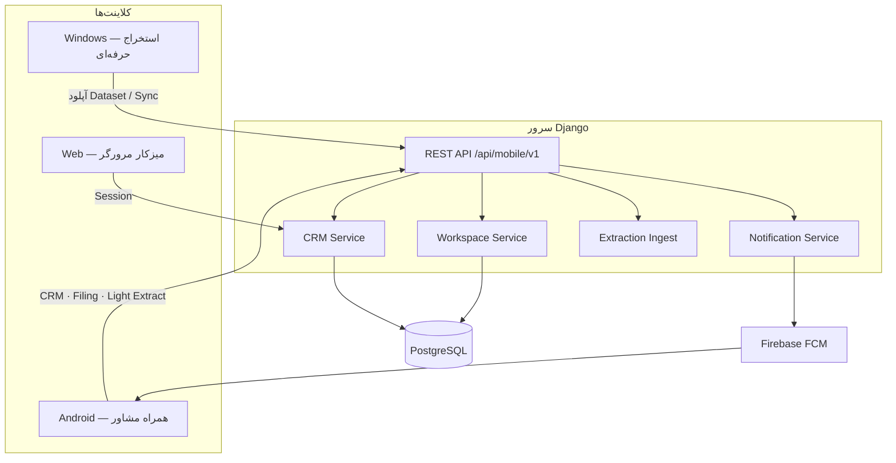
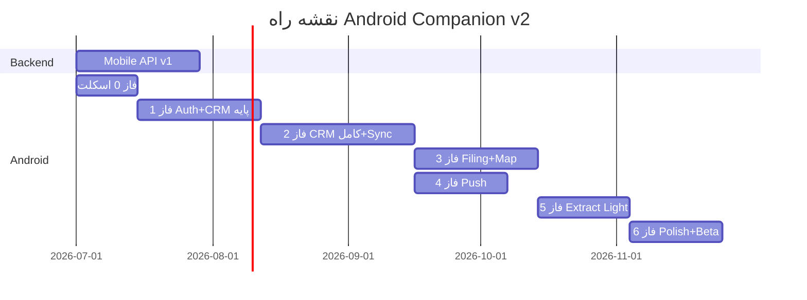
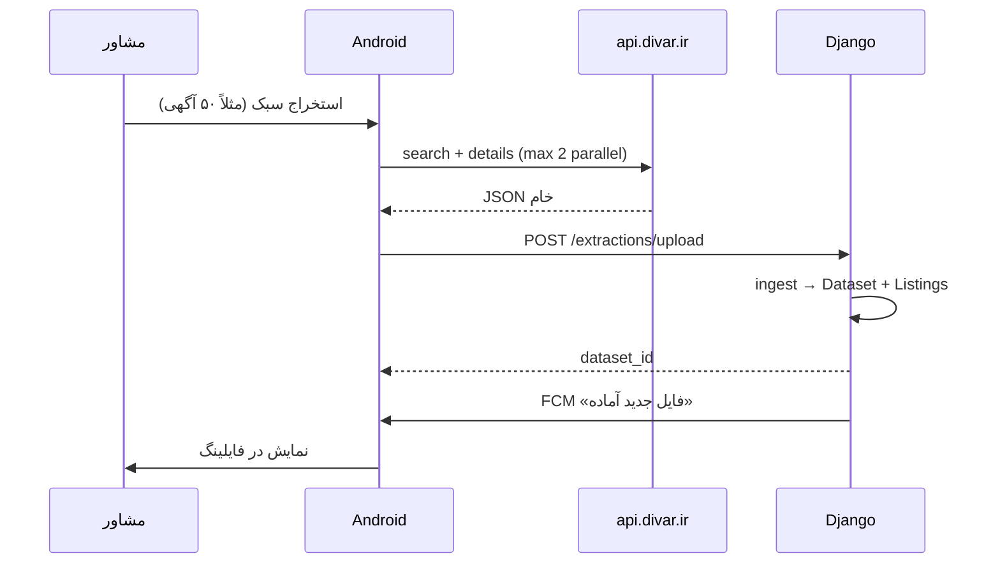

# نقشه راه — Divar Filing Mobile (همراه مشاور)

**نسخه:** 2.0  
**تاریخ:** ۲۵ ژوئن ۲۰۲۶  
**هدف:** افزایش استفاده روزانه از اکوسیستم فایلینگ دیوار — **نه** جایگزینی ویندوز

---

## فهرست

1. [خلاصه اجرایی](#۱-خلاصه-اجرایی)
2. [اکوسیستم سه‌گانه](#۲-اکوسیستم-سه‌گانه)
3. [چشم‌انداز اپ اندروید](#۳-چشم‌انداز-اپ-اندروید)
4. [دامنه و مرزها](#۴-دامنه-و-مرزها)
5. [معماری کلان](#۵-معماری-کلان)
6. [ماژول‌های اپ](#۶-ماژول‌های-اپ)
7. [فازهای توسعه](#۷-فازهای-توسعه)
8. [استخراج سبک](#۸-استخراج-سبک)
9. [CRM](#۹-crm)
10. [فایلینگ و نقشه](#۱۰-فایلینگ-و-نقشه)
11. [اعلان‌ها](#۱۱-اعلان‌ها)
12. [API سرور](#۱۲-api-سرور)
13. [KPI و موفقیت](#۱۳-kpi-و-موفقیت)
14. [ریسک‌ها](#۱۴-ریسک‌ها)
15. [زمان‌بندی](#۱۵-زمان‌بندی)

---

## ۱. خلاصه اجرایی

اکوسیستم **فایلینگ دیوار** سه جزء دارد:

| جزء | نقش |
|-----|-----|
| **Django + PostgreSQL** | مرکز — Workspace، CRM، اعلان، منطق کسب‌وکار |
| **ویندوز** | استخراج حرفه‌ای — Excel، CSV، JSON، عکس، انبوه |
| **اندروید** | همراه روزمره — CRM، Push، مشاهده فایلینگ، استخراج سبک |

اپ اندروید (این ریپو) برای این است که مشاور **هر روز** با سیستم در ارتباط باشد: پیگیری مشتری، یادآور، اعلان، نگاه سریع به فایل‌ها — و در صورت نیاز یک **استخراج سبک** (حداکثر ۱۰۰ آگهی) که مستقیم به Workspace می‌رود.

**تمرکز:** UX موبایل، سرعت، سادگی، تعامل روزانه.  
**غیرهدف:** تکرار قابلیت‌های حرفه‌ای ویندوز.

**MVP قابل انتشار:** ~۱۰ هفته (Auth + CRM + فایلینگ read-only + Push پایه)  
**نسخه کامل v1.0:** ~۲۲ هفته (CRM کامل + استخراج سبک + نقشه + اعلان‌های پیشرفته)

---

## ۲. اکوسیستم سه‌گانه



### قانون طلایی

> **منطق اصلی و دیتابیس فقط روی سرور است.**  
> کلاینت‌ها (ویندوز و اندروید) نباید منطق کسب‌وکار CRM یا فایلینگ را دوباره پیاده کنند — فقط نمایش، ورودی کاربر، و cache موقت.

جزئیات تفکیک نقش: [docs/ECOSYSTEM_ROLES.md](./docs/ECOSYSTEM_ROLES.md)

---

## ۳. چشم‌انداز اپ اندروید

### جمله محصول

> «فایلینگ دیوار در جیب مشاور» — CRM، اعلان، و دسترسی سریع به فایل‌ها؛ استخراج سبک وقتی لازم باشد.

### اولویت‌های UX (به ترتیب)

1. **CRM** — مخاطب، معامله، امروز، یادآور
2. **اعلان** — دلیل باز کردن روزانه اپ
3. **فایلینگ** — مشاهده و جستجوی datasetهای سرور
4. **نقشه** — موقعیت آگهی و مشتری
5. **استخراج سبک** — آخرین اولویت؛ فقط مکمل

### کاربر هدف

مشاور املاک که:
- بین بازدید و تماس در حرکت است
- به یادآور و پیگیری معوق نیاز دارد
- می‌خواهد فایل جدید یا کاهش قیمت را فوراً ببیند
- استخراج سنگین را روی ویندوز انجام می‌دهد

---

## ۴. دامنه و مرزها

### داخل دامنه اندروید ✅

| حوزه | محدوده |
|------|--------|
| CRM | مخاطب، ملک، معامله، فعالیت، یادآور، یادداشت، امروز، فایل شخصی |
| Sync | دوطرفه با سرور — سرور منبع حقیقت |
| فایلینگ | خواندن dataset، جستجو، فیلتر، نقشه، لینک به CRM |
| استخراج سبک | ≤۱۰۰ آگهی، ۲ concurrent، آپلود به Workspace |
| Push | FCM — یادآور، فایل جدید، قیمت، تطبیق |
| نقشه | آگهی، مشتری، مسیریابی |
| حساب | ورود، دستگاه، تنظیمات اعلان |

### خارج از دامنه اندروید ❌

| قابلیت | کلاینت مسئول |
|--------|--------------|
| Excel / CSV / JSON export | ویندوز |
| دانلود انبوه تصاویر | ویندوز |
| استخراج > ۱۰۰ آگهی | ویندوز |
| تحلیل آماری پیشرفته | ویندوز / وب |
| PDF آگهی | ویندوز / وب |
| منطق تطبیق هوشمند سنگین | **سرور** (اندروید فقط نتیجه را نشان می‌دهد) |
| پنل ادمین | Django |
| فروش و پرداخت | وب |

---

## ۵. معماری کلان

```
Android App
    │
    ├── UI (Compose)
    ├── ViewModels
    ├── Repositories  ──── cache hit? ──► Room (موقت)
    │         │
    │         └──── miss / write ──────► Retrofit
    │                                      │
    └─ Light Extract ── OkHttp ──► api.divar.ir
                                           │
                                           ▼
                              POST /api/mobile/v1/extractions/upload
                                           │
                                           ▼
                                    Django → PostgreSQL → Workspace
```

### Room — فقط Cache

| داده | سیاست cache |
|------|-------------|
| مخاطبین / معاملات | TTL + sync delta؛ stale نشان داده شود |
| لیست dataset | خلاصه + pagination cache |
| جزئیات آگهی | on-demand؛ expire ۲۴h |
| تنظیمات | DataStore |
| صف sync ناموفق | تا ارسال مجدد |

**هیچ منطق CRM روی Room به‌عنوان منبع نهایی اجرا نمی‌شود.**

---

## ۶. ماژول‌های اپ

```
android/
├── app/                      # NavHost، DI، FCM
├── core/
│   ├── network/              # Retrofit، Auth interceptor
│   ├── database/             # Room cache
│   ├── design/               # Theme RTL
│   └── common/
├── feature-auth/             # ورود، دستگاه، session
├── feature-crm/              # ★ هسته اصلی
│   ├── contacts/
│   ├── deals/
│   ├── properties/
│   ├── activities/
│   ├── reminders/
│   └── today/
├── feature-filing/           # مشاهده Workspace
│   ├── datasets/
│   ├── listings/
│   └── search
├── feature-map/              # نقشه آگهی و مشتری
├── feature-extract-light/    # استخراج سبک → upload
├── feature-notifications/    # FCM handler، deep links
└── feature-settings/         # اعلان، پروفایل
```

---

## ۷. فازهای توسعه



---

### فاز ۰ — اسکلت (۲ هفته)

| تحویل | جزئیات |
|-------|--------|
| پروژه Gradle چندماژوله | ساختار بالا |
| Design System | Vazirmatn، RTL، رنگ فایلینگ |
| Retrofit + Auth | JWT refresh |
| Room schema | cache entities |
| Navigation | Bottom nav: خانه، CRM، فایلینگ، بیشتر |

---

### فاز ۱ — Auth + CRM پایه (۴ هفته)

**هدف:** مشاور بتواند وارد شود و مخاطب ببیند/بسازد

| هفته | تحویل |
|------|--------|
| ۱ | Login، register device، token storage |
| ۲ | لیست مخاطبین (از API)، جستجو |
| ۳ | پروفایل مخاطب — مشاهده + ویرایش |
| ۴ | ثبت سریع سرنخ، صفحه خانه ساده |

**وابستگی سرور:** Auth + Contacts CRUD API

---

### فاز ۲ — CRM کامل + Sync (۵ هفته)

| تحویل | جزئیات |
|-------|--------|
| معاملات | لیست، pipeline، جزئیات |
| املاک CRM | CRUD + لینک مخاطب |
| فعالیت و یادداشت | تایم‌لاین |
| یادآور | ایجاد، لیست، انجام‌شده |
| **امروز** | صف کار روز — تماس، بازدید، معوق |
| فایل شخصی | پروفایل مشتری کامل |
| Sync engine | delta pull/push؛ offline queue |

---

### فاز ۳ — فایلینگ + نقشه (۴ هفته)

| تحویل | جزئیات |
|-------|--------|
| لیست datasetها | از Workspace سرور |
| جستجو و فیلتر آگهی | server-side pagination |
| جزئیات آگهی | بدون دانلود عکس bulk |
| نقشه آگهی‌ها | cluster markers |
| لینک آگهی → CRM | «افزودن به مشتری» |
| نقشه مشتری | موقعیت تقریبی در صورت وجود |

---

### فاز ۴ — Push Notification (۳ هفته، موازی با ۳)

| تحویل | جزئیات |
|-------|--------|
| FCM integration | token → سرور |
| Deep links | CRM، آگهی، امروز |
| کانال‌های اعلان | قابل خاموش در تنظیمات |
| سرور: Celery tasks | یادآور، digest، قیمت |

جزئیات: [docs/NOTIFICATIONS.md](./docs/NOTIFICATIONS.md)

---

### فاز ۵ — استخراج سبک (۳ هفته)

| تحویل | جزئیات |
|-------|--------|
| UI فیلتر ساده | شهر، محله، معامله، تعداد ≤۱۰۰ |
| Divar client نازک | ۲ concurrent، rate limit |
| Foreground job | progress + cancel |
| آپلود به سرور | `POST .../extractions/upload` |
| بدون فایل محلی | dataset روی Workspace ساخته می‌شود |
| اعلان «استخراج تمام شد» | local + push |

**مرجع منطق HTTP دیوار** (فقط مطالعه): [docs/reference/export_divar_items.py](./docs/reference/export_divar_items.py)  
**بدون کپی** flatten/تحلیل/Excel در اپ — سرور Django ingest می‌کند.

---

### فاز ۶ — Polish + Beta (۳ هفته)

| تحویل | جزئیات |
|-------|--------|
| مسیریابی نقشه | Intent به Maps |
| بهینه‌سازی cache | |
| تست دستگاه‌های مختلف | |
| Firebase App Distribution beta | |
| Play Store internal track | |

---

## ۸. استخراج سبک

### محدودیت‌های سخت (غیرقابل تغییر در اپ)

| پارامتر | مقدار |
|---------|--------|
| حداکثر آگهی | **۱۰۰** |
| درخواست همزمان | **۲** |
| خروجی Excel/CSV/JSON | **خیر** |
| دانلود تصویر | **خیر** |
| مقصد داده | **Workspace روی سرور** |

### جریان



### تقسیم مسئولیت

| لایه | مسئولیت |
|------|---------|
| Android | HTTP به دیوار + ارسال payload خام |
| Django | parse، flatten، dedupe، ذخیره Listing، ساخت Dataset |
| Windows | همان ingest از فایل — مسیر موازی |

---

## ۹. CRM

### صفحات اصلی (Bottom Navigation)

```
🏠 خانه        — خلاصه امروز، اعلان‌های اخیر، میانبر
👥 CRM         — مخاطبین | معاملات | املاک | امروز
📁 فایلینگ     — datasetها و آگهی‌ها
⚡ استخراج     — سبک (یا داخل «بیشتر»)
⚙️ بیشتر       — تنظیمات، نقشه، پروفایل
```

### قابلیت‌ها (همه sync با سرور)

- مخاطبین — CRUD، pipeline، جستجو
- معاملات — مراحل، checklist (از سرور)
- املاک — وضعیت معامله
- فعالیت — تماس، واتساپ، بازدید، یادداشت
- یادآور — با Push سررسید
- امروز — کارهای actionable
- فایل شخصی — بودجه، نیاز، تاریخچه

**منطق تطبیق «فایل مناسب مشتری»** روی سرور اجرا می‌شود؛ اپ فقط push + نمایش نتیجه.

---

## ۱۰. فایلینگ و نقشه

### فایلینگ (read از سرور)

- لیست مجموعه‌های آپلودشده (ویندوز یا استخراج سبک)
- جستجوی متنی و فیلتر (قیمت، متراژ، محله)
- جزئیات آگهی + لینک به دیوار
- «افزودن به مخاطب» → CRM API

### نقشه

| لایه | منبع داده |
|------|-----------|
| آگهی‌های dataset | API filing |
| موقعیت مشتری | CRM (در صورت ثبت آدرس) |
| فایل‌های اطراف | API geo query سرور |
| مسیریابی | Android Intent → Google Maps |

---

## ۱۱. اعلان‌ها

| رویداد | منبع |
|--------|------|
| یادآور تماس | سرور FCM |
| یادآور بازدید | سرور FCM |
| استخراج پایان یافت | سرور (+ local fallback) |
| فایل جدید پیدا شد | سرور (پس از ingest ویندوز یا موبایل) |
| کاهش قیمت ملک | سرور (price watch) |
| فایل مناسب مشتری | سرور (matching job) |
| کارهای امروز | سرور — صبح |
| پیگیری معوق | سرور |

---

## ۱۲. API سرور

تمام endpointها در [docs/MOBILE_API_SPEC.md](./docs/MOBILE_API_SPEC.md).

### گروه‌های API

| گروه | نمونه |
|------|--------|
| Auth | login، refresh، logout |
| Device | register، fcm_token |
| CRM Contacts | list، get، create، update، delete |
| CRM Deals | list، pipeline، stages |
| CRM Properties | CRUD |
| Activities | list، create |
| Reminders | list، create، complete |
| Today | GET /crm/today |
| Filing | datasets، listings، search |
| Map | geo/listings، geo/nearby |
| Extraction | start (optional)، upload |
| Notifications | preferences |
| Settings | profile، notification prefs |
| Sync | delta bulk endpoint |

**فاز Backend (Django):** اپ `mobile_api` — موازی با توسعه اندروید از هفته ۱.

---

## ۱۳. KPI و موفقیت

| KPI | هدف ۳ ماه پس از launch |
|-----|------------------------|
| DAU / MAU | > ۰.۴ |
| باز کردن اپ از طریق Push | > ۳۵٪ |
| CRM action روزانه per user | > ۲ |
| زمان sync CRM | < ۵ ثانیه |
| استخراج سبک per user / هفته | < ۲ (مکمل، نه اصلی) |
| Crash-free sessions | > ۹۹.۵٪ |
| NPS | ≥ ۴/۵ |

**موفقیت = تعامل روزانه CRM** — نه تعداد استخراج موبایل.

---

## ۱۴. ریسک‌ها

| ریسک | کاهش |
|------|------|
| تکرار منطق CRM در اپ | Code review + «همه write از API» |
| API Django دیر آماده | Mock server + قرارداد ثابت |
| بن دیوار در استخراج سبک | rate limit سخت، ۲ worker |
| وابستگی به اینترنت | cache read-only + queue |
| کاربر انتظار Excel موبایل | UX واضح + لینک به ویندوز |

---

## ۱۵. زمان‌بندی

| فاز | مدت | خروجی | تجمعی |
|-----|-----|--------|-------|
| Backend API v1 | ۴ هفته | Auth + CRM + Filing read | ۴ هفته |
| ۰ اسکلت | ۲ هفته | پروژه + design | ۲ هفته |
| ۱ Auth + CRM پایه | ۴ هفته | مخاطب | ۶ هفته |
| ۲ CRM کامل | ۵ هفته | sync کامل | ۱۱ هفته |
| ۳ Filing + Map | ۴ هفته | مشاهده فایل | ۱۵ هفته |
| ۴ Push | ۳ هفته | FCM | ۱۵ هفته (موازی) |
| ۵ Extract light | ۳ هفته | آپلود به Workspace | ۱۸ هفته |
| ۶ Beta | ۳ هفته | انتشار | ۲۱ هفته |

**MVP (فاز ۰–۲ + Push پایه):** ~۱۱ هفته  
**v1.0 کامل:** ~۲۱ هفته

---

## گام بعدی

1. تأیید نقشه راه v2
2. شروع `mobile_api` در Django (موازی)
3. فاز ۰ — scaffold اندروید
4. Mock API برای توسعه UI بدون انتظار backend

---

*نسخه ۲.۰ — جایگزینی ویندوز از scope حذف شد.*
