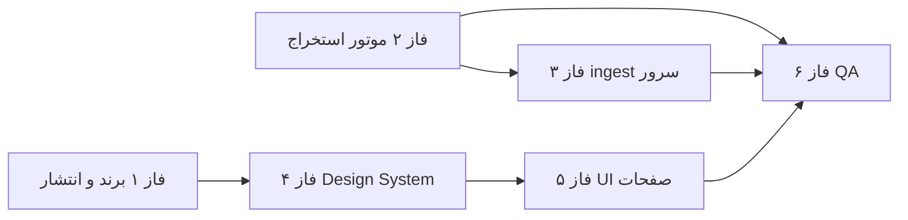

# نقشه راه — اصلاحات تولید و کیفیت (v2.1)

**تاریخ:** ۲۶ ژوئن ۲۰۲۶  
**هدف:** رفع ایرادهای گزارش‌شده پس از نصب اولیه و رساندن اپ به سطح حرفه‌ای و هم‌تراز با خروجی ویندوز

---

## خلاصه ایرادها و علت ریشه‌ای

| # | ایراد گزارش‌شده | علت ریشه‌ای (تحلیل کد) | محل اصلاح |
|---|----------------|------------------------|-----------|
| 1 | هشدار Play Protect هنگام نصب | APK دیباگ، بدون امضای release، توسعه‌دهنده ناشناس | CI + امضا + راهنمای نصب |
| 2 | لوگو با سایت یکی نیست | آیکن فعلی: خانه ساده (`ic_launcher_foreground.xml`) | دارایی برند + adaptive icon |
| 3 | UI غیرحرفه‌ای | Material3 پایه، رنگ سبز (سایت بنفش)، بدون design system | فاز طراحی |
| 4 | نام فایل / موضوع / معامله / مکان اشتباه | سرور: `mobile_extraction.json`، `residential-sell`، `1` — متادیتای فارسی کامل ارسال نمی‌شود | موبایل + سرور |
| 5 | ستون مشخصات JSON نشان می‌دهد | `flatten_post_detail` روی سرور ناقص یا raw ذخیره شده | عمدتاً سرور؛ موبایل: ساختار raw |
| 6 | فقط آگهی شخصی (با انتخاب «همه») | موبایل: `business_lazy` فقط برای `premium-panel`؛ ویندوز: کشف داینامیک `BUSINESS_SECTION` | موبایل + سرور |
| 7 | روند استخراج ≠ ویندوز | تفاوت UA، lazy API، متادیتا، فیلتر آگهی‌دهنده | موبایل + سرور |

---

## وابستگی‌ها



**اولویت فوری (داده):** فاز ۲ و ۳ — بدون آن خروجی در میزکار درست نمی‌شود.  
**اولویت تجربه کاربر:** فاز ۱، ۴، ۵.

---

## فاز ۱ — برندینگ و انتشار امن (۳–۵ روز)

### ۱.۱ لوگو و آیکن
- [ ] دریافت لوگوی رسمی از `divarfiling.ir` (برج آبی / آیکن میزکار)
- [ ] تولید `ic_launcher_foreground`، `ic_launcher_background`، splash
- [ ] افزودن `logo_divarfiling` به `drawable` برای استفاده در Login، Home، Extract
- [ ] هم‌راستایی رنگ برند با وب (بنفش `#5B4FCF` / `#6C63FF` به‌جای سبز فعلی)

**فایل‌های هدف:**
- `android/app/src/main/res/drawable/`
- `android/app/src/main/res/mipmap-anydpi-v26/`

### ۱.۲ امضای Release و Play Protect
- [ ] پیکربندی `signingConfigs` در `build.gradle.kts` (keystore در secrets / env)
- [ ] workflow: `assembleRelease` + artifact
- [ ] سند `docs/INSTALL_GUIDE_FA.md`: «Install anyway»، غیرفعال‌سازی موقت Play Protect، یا Internal Testing در Play Console

> **نکته:** هشدار Play Protect خطای برنامه نیست؛ برای APKهای sideload طبیعی است. APK امضا‌شده + انتشار رسمی هشدار را کم می‌کند.

---

## فاز ۲ — موتور استخراج هم‌تراز با ویندوز (۱–۲ هفته) ⚡ بحرانی

مرجع: `docs/reference/export_divar_items.py`

### ۲.۱ دریافت اطلاعات مشاور (رفع «فقط شخصی»)
- [ ] پورت `_find_business_lazy_request()` به Kotlin در `DivarLightClient`
- [ ] استفاده از `rest_request_path` و `request_data` داینامیک از `BUSINESS_SECTION`
- [ ] fallback به endpoint فعلی فقط وقتی section وجود ندارد
- [ ] نوع درخواست: `premium_panel.GetPostBusinessLazyWidgetsRequest` (مثل ویندوز، نه فقط `premium_user.BusinessLazyRequest`)

**فایل:** `DivarLightClient.kt`

### ۲.۲ User-Agent و هدرها
- [ ] detail fetch با UA دسکتاپ Chrome (مثل ویندوز) برای سازگاری پاسخ API
- [ ] list search می‌تواند mobile بماند یا یکسان شود — تست A/B

### ۲.۳ متادیتای کامل آپلود
گسترش `ExtractionFiltersDto` / `ExtractFilters`:

```kotlin
// فیلدهای پیشنهادی
transaction_type_label: String      // "فروش مسکونی"
category_label: String             // "آپارتمان"
district_names: List<String>        // ["استاد معین"]
province_name: String?
output_name_hint: String?           // "ostad-moein_20260626_115900"
source_client: String = "android_light"
```

- [ ] `ExtractViewModel` مقادیر فارسی را از `ExtractCategories` + `PlacesRepository` پر کند
- [ ] تولید `output_name_hint` با الگوی ویندوز: `{district_slug}_{YYYYMMDD_HHMMSS}`

**فایل‌ها:** `ApiModels.kt`, `ExtractionRepository.kt`, `ExtractViewModel.kt`

### ۲.۴ فیلتر آگهی‌دهنده
- [ ] UI: گزینه‌های واضح — «همه» | «فقط شخصی» | «فقط مشاور» (در صورت نیاز)
- [ ] اگر `personal`: فیلتر client-side پس از fetch (منطق `_filter_by_advertiser_type`)
- [ ] اگر `consultant`: فقط آگهی‌های دارای business_type مشاور
- [ ] `all`: بدون فیلتر — **همه** آپلود شوند

### ۲.۵ تست واحد
- [ ] تست پارس `BUSINESS_SECTION` روی JSON نمونه از `docs/reference/`
- [ ] تست ساخت `output_name_hint`

---

## فاز ۳ — سرور Django: ingest و نمایش میزکار (۱–۲ هفته) ⚡ بحرانی

> این فاز در ریپوی سرور (`mobile_api` / `extraction_ingest`) انجام می‌شود. موبایل فقط قرارداد API را مصرف می‌کند.

### ۳.۱ نام‌گذاری Dataset
- [ ] به‌جای `mobile_extraction.json` → `{area_slug}_{timestamp}.json` یا `.xlsx` (هم‌تراز ویندوز)
- [ ] `transaction_type` فارسی: «فروش» / «اجاره» — نه slug انگلیسی
- [ ] `subject` فارسی: «آپارتمان» — نه `residential-sell`
- [ ] `city` / `district` فارسی — نه `city_id=1`

### ۳.۲ flatten کامل
- [ ] استفاده از همان `flatten_post_detail` ویندوز روی `items[].raw`
- [ ] پر کردن: آسانسور، پارکینگ، انباری، مشاور_نام، نوع آگهی‌دهنده
- [ ] **حذف نمایش raw JSON** در ستون مشخصات و تب «سایر جزئیات»

### ۳.۳ طبقه‌بندی آگهی‌دهنده
- [ ] اگر `business_lazy_widget_list` موجود → استخراج نام مشاور
- [ ] `advertiser_type`: «شخصی» | «مشاور» در آمار و جدول

### ۳.۴ قرارداد API
- [ ] به‌روزرسانی `docs/MOBILE_API_SPEC.md` §۱۴ با فیلدهای جدید
- [ ] نسخه‌گذاری ingest: `ingest_version: 2`

---

## فاز ۴ — Design System حرفه‌ای (۱ هفته)

### ۴.۱ پالت و تایپوگرافی
- [ ] رنگ‌های برند از وب (primary بنفش، surface سفید/خاکستری روشن)
- [ ] فونت فارسی: Vazirmatn یا IRANSansX (local font در `res/font`)
- [ ] `Typography` سفارشی Material3

**فایل:** `core/design/Theme.kt` → گسترش به `Color.kt`, `Type.kt`, `Shape.kt`

### ۴.۲ کتابخانه کامپوننت
پوشه جدید: `core/design/components/`

| کامپوننت | کاربرد |
|----------|--------|
| `DfTopBar` | AppBar یکپارچه با لوگو |
| `DfCard` | کارت با سایه و گوشه ۱۶dp |
| `DfButton` | primary / outlined / loading |
| `DfDropdown` | جایگزین ExposedDropdownMenuBox پراکنده |
| `DfStatChip` | آمار استخراج (شخصی/مشاور) |
| `DfProgressBlock` | پیشرفت استخراج با انیمیشن |
| `DfEmptyState` | حالت خالی |
| `DfListingRow` | ردیف آگهی در فایلینگ |

### ۴.۳ الگوهای UX
- [ ] فاصله‌گذاری ۸dp grid
- [ ] haptic روی اکشن‌های مهم
- [ ] skeleton loading
- [ ] pull-to-refresh در لیست‌ها

---

## فاز ۵ — بازطراحی صفحات (۲–۳ هفته)

### ۵.۱ Login
- [ ] لوگوی بزرگ مرکزی، گرادیان ملایم، فرم شیشه‌ای
- [ ] پیام خوش‌آمد + نسخه اپ

### ۵.۲ Home (داشبورد)
- [ ] کارت‌های KPI: فایل‌های امروز، مخاطبین، یادآور
- [ ] دسترسی سریع: استخراج، فایلینگ، CRM

### ۵.۳ Extract (اولویت بالا)
- [ ] wizard سه‌مرحله‌ای: موقعیت → دسته‌بندی → فیلترها
- [ ] پیش‌نمایش خلاصه قبل از شروع
- [ ] progress واقعی با ETA تقریبی
- [ ] نتیجه: تعداد شخصی/مشاور + لینک مستقیم به dataset

### ۵.۴ Filing
- [ ] لیست dataset با badge فرمت (XLS/JSON)
- [ ] جزئیات آگهی: مشخصات فرمت‌شده، نه JSON
- [ ] فیلتر آگهی‌دهنده در UI فایلینگ

### ۵.۵ CRM + Settings
- [ ] هم‌ترازی بصری با صفحات بالا
- [ ] تنظیمات: تم، اعلان، درباره، راهنمای نصب

---

## فاز ۶ — QA، انتشار و پایش (۱ هفته)

### ۶.۱ چک‌لیست تست دستی
- [ ] استخراج ۵۰ آگهی تهران — آپارتمان فروش — همه آگهی‌دهنده‌ها
- [ ] تأیید: ≥۱ مشاور در آمار میزکار
- [ ] تأیید: نام فایل و ستون‌ها مثل ویندوز
- [ ] تأیید: مشخصات بدون JSON خام
- [ ] نصب APK release روی ۲ دستگاه مختلف

### ۶.۲ انتشار
- [ ] تگ `v2.1.0-android`
- [ ] artifact release در GitHub Actions
- [ ] (اختیاری) Play Console Internal Testing

---

## ترتیب اجرا پیشنهادی

| مرحله | فاز | خروجی قابل مشاهده |
|-------|-----|-------------------|
| **۱** | فاز ۲.۱–۲.۲ | مشاورها در داده raw |
| **۲** | فاز ۲.۳–۲.۴ + فاز ۳ | فایل درست در میزکار |
| **۳** | فاز ۱ | لوگو + APK امضا‌شده |
| **۴** | فاز ۴ | Design System |
| **۵** | فاز ۵ | UI حرفه‌ای تمام صفحات |
| **۶** | فاز ۶ | انتشار v2.1 |

---

## فایل‌های کلیدی این ریپو

| موضوع | مسیر |
|-------|------|
| کلاینت Divar | `android/.../feature/extract/divar/DivarLightClient.kt` |
| فیلترها | `android/.../feature/extract/divar/ExtractFilters.kt` |
| آپلود | `android/.../data/repository/ExtractionRepository.kt` |
| UI استخراج | `android/.../feature/extract/ExtractScreen.kt` |
| تم | `android/.../core/design/Theme.kt` |
| مرجع ویندوز | `docs/reference/export_divar_items.py` |
| قرارداد API | `docs/MOBILE_API_SPEC.md` |

---

## معیار پذیرش نهایی (Definition of Done)

1. نصب APK release بدون نیاز به توضیح پیچیده (یا با راهنمای یک‌صفحه‌ای)
2. لوگو = لوگوی سایت در launcher و داخل اپ
3. dataset موبایل در میزکار **غیرقابل تشخیص** از خروجی ویندوز (نام، موضوع، مکان، فرمت)
4. ستون مشخصات: متن فارسی و آیکن امکانات — **بدون** `raw: {`
5. انتخاب «همه آگهی‌دهنده‌ها»: آمار شخصی + مشاور هر دو > ۰ (در صورت وجود در دیوار)
6. UI سطح Material3 حرفه‌ای با فونت فارسی و رنگ برند وب

---

*پس از تأیید این نقشه، اجرا از **مرحله ۱ (فاز ۲ — موتور استخراج)** شروع می‌شود چون بیشترین تأثیر روی داده‌های اشتباه میزکار را دارد.*
