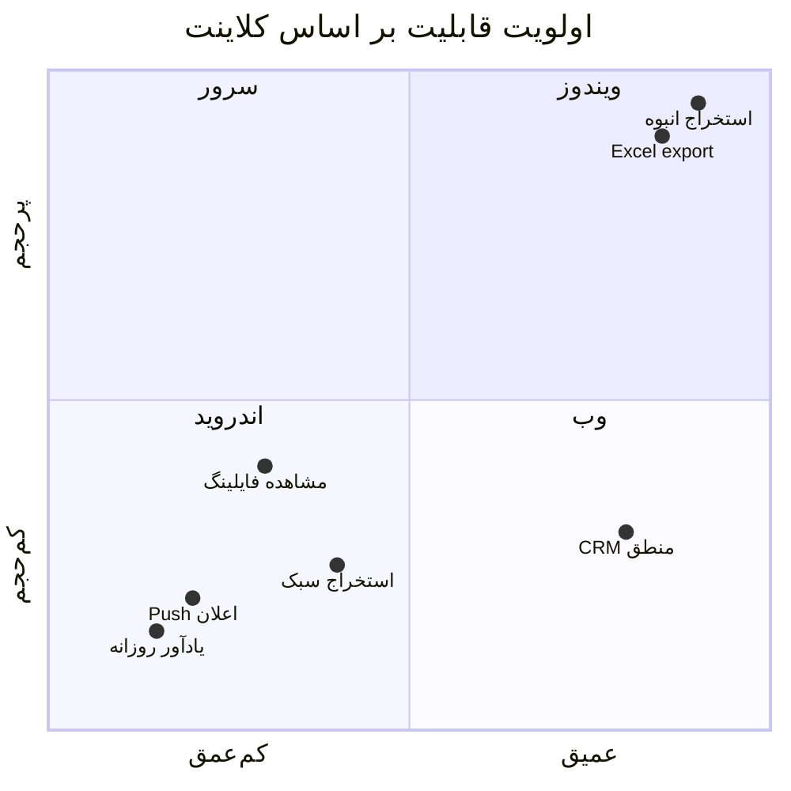

# نقش اجزای اکوسیستم فایلینگ دیوار

**نسخه:** 2.0

این سند مرز مسئولیت **سرور**، **ویندوز** و **اندروید** را مشخص می‌کند.  
اپ اندروید **جایگزین ویندوز نیست** — مکمل آن است.

---

## نمای کلی

---

## ۱. سرور Django (مرکز سیستم)

### مسئولیت

| حوزه | جزئیات |
|------|--------|
| **دیتابیس** | PostgreSQL — منبع حقیقت واحد |
| **Workspace** | Dataset، Listing، import از ویندوز و موبایل |
| **CRM** | تمام منطق مخاطب، معامله، ملک، فعالیت |
| **Ingest** | parse و flatten آگهی پس از upload |
| **Matching** | «فایل مناسب مشتری» |
| **Price watch** | تشخیص کاهش قیمت → اعلان |
| **Notifications** | FCM، زمان‌بندی Celery |
| **Auth** | کاربر، لایسنس، دستگاه |
| **فروشگاه** | پرداخت، لایسنس (وب) |

### چه چیزی روی سرور **نباید** تکرار شود در کلاینت

- قوانین pipeline CRM
- dedupe مخاطب
- محاسبه امتیاز تطبیق
- ساخت Excel فرمت‌دار
- ذخیره نهایی Listing

---

## ۲. نرم‌افزار ویندوز (استخراج حرفه‌ای)

### مسئولیت ✅

| قابلیت | توضیح |
|--------|--------|
| استخراج بدون محدودیت عملی | تا سقف پلن (۵۰۰+) |
| Excel حرفه‌ای | openpyxl |
| CSV / JSON | export محلی |
| دانلود تصاویر | bulk |
| استخراج انبوه | multi-thread، scheduler |
| تحلیل آماری | matplotlib |
| نقشه HTML | Folium |
| PDF آگهی | |
| آپلود به Workspace | اختیاری / Pro |

### مسئولیت ❌ (نیست)

| قابلیت | کلاینت جایگزین |
|--------|----------------|
| Push یادآور CRM | **اندروید** |
| CRM در حرکت | **اندروید** |
| مشاهده سریع فایل در جیب | **اندروید** |

### ارتباط با سرور

- لایسنس: `X-Bot-Api-Key`
- آپلود dataset (اختیاری)
- CRM Tkinter / وب — session جدا

---

## ۳. اپ اندروید (همراه مشاور)

### مسئولیت ✅

| # | حوزه | محدوده |
|---|------|--------|
| 1 | **CRM** | مخاطب، معامله، ملک، فعالیت، یادآور، یادداشت، امروز، فایل شخصی |
| 2 | **Sync** | دوطرفه با سرور |
| 3 | **Push** | دریافت و deep link |
| 4 | **فایلینگ** | مشاهده، جستجو، فیلتر — داده از API |
| 5 | **نقشه** | آگهی، مشتری، اطراف، مسیریابی |
| 6 | **استخراج سبک** | ≤۱۰۰ آگهی، ۲ concurrent، upload به سرور |

### مسئولیت ❌ (عمداً خارج از scope)

| قابلیت | دلیل |
|--------|------|
| Excel / CSV / JSON export | ویندوز |
| دانلود انبوه عکس | ویندوز |
| استخراج > ۱۰۰ | ویندوز |
| تحلیل پیشرفته | ویندوز / وب |
| منطق CRM سنگین | سرور |
| فروش و پرداخت | وب |

---

## ۴. مقایسه سریع

| قابلیت | سرور | ویندوز | اندروید |
|--------|:----:|:------:|:-------:|
| دیتابیس اصلی | ✅ | — | cache |
| CRM write logic | ✅ | — | UI فقط |
| استخراج حرفه‌ای | ingest | ✅ | — |
| استخراج سبک ≤۱۰۰ | ingest | — | ✅ collect |
| Excel export | — | ✅ | ❌ |
| Push notification | send | — | receive |
| مشاهده فایلینگ | API | آپلود | ✅ read |
| نقشه تعاملی | geo API | HTML | ✅ native |
| یادآور روزانه | schedule | — | ✅ UX |

---

## ۵. سناریوهای کاربر

### سناریو A — مشاور صبح

1. Push «۵ کار امروز»
2. باز کردن اپ → تب امروز
3. تماس با مشتری → ثبت فعالیت → sync سرور

### سناریو B — فایل جدید روی ویندوز

1. شب: استخراج ۳۰۰ آگهی روی PC
2. آپلود dataset به Workspace
3. صبح: Push «فایل جدید — ونک فروش»
4. مشاور روی موبایل browse می‌کند

### سناریو C — استخراج سبک در خیابان

1. مشاور «استخراج سبک» ۴۰ آگهی
2. اپ → دیوار → upload سرور
3. Push «استخراج تمام شد»
4. مشاهده در فایلینگ — بدون فایل Excel

### سناریو D — تطبیق هوشمند

1. سرور: matching job شبانه
2. Push «۳ فایل مناسب برای رضا احمدی»
3. مشاور → پروفایل مشتری → پیشنهادها

---

## ۶. پیام‌رسانی به کاربر

در اپ و سایت باید شفاف باشد:

> «برای استخراج حرفه‌ای، Excel و دانلود عکس از **نرم‌افزار ویندوز** استفاده کنید.  
> اپ موبایل برای **مدیریت روزانه CRM** و **دسترسی سریع به فایل‌ها** طراحی شده است.»

---

## ۷. تکامل آینده (بدون ادغام کلاینت)

| جهت | توضیح |
|-----|--------|
| سرور قوی‌تر | matching، automation، API عمومی |
| ویندوز | همان niche حرفه‌ای |
| اندروید | CRM عمیق‌تر، widget، wear |
| iOS | کلاینت مشابه اندروید (فاز بعد) |

**بدون هدف:** ادغام ویندوز و اندروید در یک codebase.

---

*این سند جایگزین `FEATURE_PARITY.md` (نسخه ۱ — حذف شد) است.*
