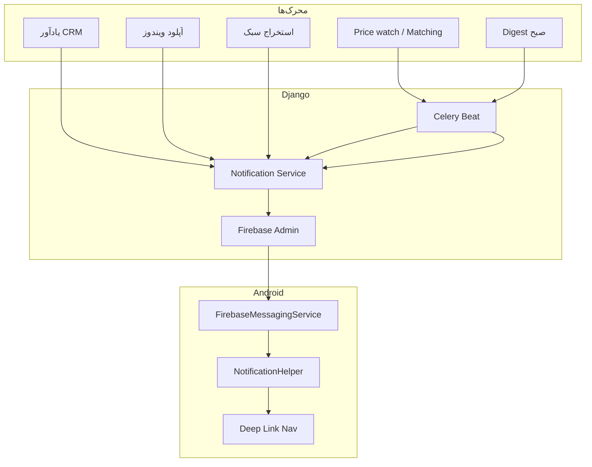

# استراتژی Push Notification

**نسخه:** 2.0  
**پلتفرم:** Firebase Cloud Messaging (FCM)  
**اصل:** اعلان دلیل اصلی باز کردن روزانه اپ — نه استخراج

---

## ۱. نقش اعلان در محصول

اپ اندروید **همراه روزمره** است. Push باعث می‌شود مشاور:

- یادآور تماس را از دست ندهد
- از فایل جدید (ویندوز یا استخراج سبک) باخبر شود
- کاهش قیمت و تطبیق مشتری را فوراً ببیند
- صبح «کارهای امروز» را دریافت کند

**بدون Push، ارزش CRM موبایل به‌شدت کاهش می‌یابد.**

---

## ۲. معماری



### تقسیم مسئولیت

| لایه | کار |
|------|-----|
| **سرور** | تصمیم «چه زمانی» + محتوا + ارسال FCM |
| **اندروید** | نمایش، کانال، deep link، ترجیحات کاربر |
| **ویندوز** | بدون Push — فقط trigger غیرمستقیم via upload |

---

## ۳. انواع اعلان

### A — سرور → FCM (اصلی)

| type | عنوان نمونه | محرک |
|------|-------------|------|
| `crm_reminder_call` | یادآور تماس | `due_at` یادآور |
| `crm_reminder_visit` | یادآور بازدید | `due_at` |
| `today_digest` | ۵ کار امروز | Cron ۰۸:۰۰ timezone کاربر |
| `overdue_followup` | ۲ پیگیری معوق | Cron روزانه |
| `new_dataset` | فایل جدید: ونک فروش | پس از ingest ویندوز/موبایل |
| `extract_complete` | استخراج سبک تمام شد | پس از `POST /extractions/upload` |
| `price_drop` | کاهش قیمت — آپارتمان ونک | price watch job |
| `customer_match` | ۳ فایل مناسب برای رضا احمدی | matching job |
| `license_expiring` | لایسنس ۷ روز دیگر منقضی | cron |

### B — Local (فقط fallback)

| رویداد | زمان |
|--------|------|
| استخراج سبک تمام (بدون شبکه برای FCM) | پایان Foreground job |
| sync ناموفق بعد از ۳ تلاش | اختیاری |

**قانون:** یادآور CRM حتی local alarm دارد اگر FCM block شده — ولی **سرور همچنان منبع زمان‌بندی** است.

---

## ۴. Payload استاندارد

### Data-only message (پیشنهادی)

```json
{
  "type": "crm_reminder_call",
  "title": "یادآور تماس",
  "body": "تماس با رضا احمدی — خریدار آپارتمان",
  "entity_type": "reminder",
  "entity_id": "55",
  "contact_id": "101",
  "deep_link": "divarfiling://crm/contacts/101",
  "priority": "high",
  "created_at": "2026-06-26T09:00:00Z"
}
```

### Deep links

| type | deep_link |
|------|-----------|
| reminder | `divarfiling://crm/contacts/{id}` |
| today_digest | `divarfiling://crm/today` |
| new_dataset | `divarfiling://filing/datasets/{id}` |
| extract_complete | `divarfiling://filing/datasets/{id}` |
| price_drop | `divarfiling://filing/listings/{token}` |
| customer_match | `divarfiling://crm/contacts/{id}/matches` |
| overdue | `divarfiling://crm/today?tab=overdue` |

---

## ۵. کانال‌های Android

| channel_id | نام | importance |
|------------|-----|------------|
| `crm_reminders` | یادآور مشتری | HIGH |
| `crm_digest` | کارهای امروز | DEFAULT |
| `filing_updates` | فایل و قیمت | DEFAULT |
| `extract` | استخراج سبک | LOW |
| `account` | حساب و لایسنس | HIGH |

کاربر از `Settings > Notifications` در اپ و سیستم می‌تواند خاموش کند — هم‌تراز `PATCH /settings/notifications`.

---

## ۶. پیاده‌سازی Android

```kotlin
class DivarFilingMessagingService : FirebaseMessagingService() {
    override fun onMessageReceived(msg: RemoteMessage) {
        val prefs = notificationPrefs.get()
        val type = msg.data["type"] ?: return
        if (!prefs.isEnabled(type)) return
        NotificationHelper.show(this, msg.data)
    }

    override fun onNewToken(token: String) {
        deviceRepository.updateFcmToken(token)
    }
}
```

### ثبت token

- پس از login
- `onNewToken`
- هر ۷ روز (heartbeat اختیاری)

---

## ۷. پیاده‌سازی Django

### مدل

```python
class MobileDevice(models.Model):
    user = models.ForeignKey(User, on_delete=models.CASCADE)
    device_id = models.CharField(max_length=64, unique=True)
    fcm_token = models.CharField(max_length=255, blank=True)
    notification_prefs = models.JSONField(default=dict)
    last_seen_at = models.DateTimeField(auto_now=True)
```

### Celery tasks

| Task | Schedule |
|------|----------|
| `send_due_reminders` | هر ۵ دقیقه |
| `send_today_digest` | ۰۸:۰۰ per user timezone |
| `send_overdue_followups` | ۰۹:۰۰ روزانه |
| `run_price_watch` | هر ۶ ساعت |
| `run_customer_matching` | شبانه ۰۲:۰۰ |
| `cleanup_invalid_fcm_tokens` | هفتگی |

### پس از رویدادهای کلیدی

```python
# پس از extraction ingest
notify_user(user, type='extract_complete', dataset_id=ds.pk)
notify_user(user, type='new_dataset', dataset_id=ds.pk)

# پس از Windows dataset upload (موجود — گسترش)
notify_agency_members(agency, type='new_dataset', ...)
```

---

## ۸. اعلان‌های مرتبط با ویندوز

مشاور شب روی PC استخراج می‌کند → صبح Push روی موبایل:

```
«فایل جدید: ونک فروش — ۲۸۷ آگهی»
```

**ویندوز خودش Push نمی‌فرستد** — سرور پس از ingest/upload.

---

## ۹. حریم خصوصی

- FCM token در `MobileDevice` — فقط برای اعلان کاری
- بدون ارسال متن کامل آگهی در push — فقط عنوان + deep link
- Privacy Policy به‌روز شود

---

## ۱۰. متریک‌ها

| متریک | هدف |
|-------|-----|
| Delivery rate | > ۹۵٪ |
| Open rate from push | > ۳۵٪ |
| Reminder acted within 1h | > ۴۰٪ |
| Notification opt-out | < ۱۰٪ |

---

## ۱۱. چک‌لیست فاز ۴

- [ ] Firebase project + `google-services.json`
- [ ] `DivarFilingMessagingService` + channels
- [ ] Deep link NavHost
- [ ] `POST /devices/register` + PATCH fcm
- [ ] `NotificationPreference` model + API
- [ ] Celery: reminders + digest
- [ ] Celery: price_drop + customer_match (فاز ۵+)
- [ ] تست روی دستگاه فیزیکی

---

*نسخه ۲.۰ — تمرکز CRM و فایلینگ؛ استخراج سبک اولویت پایین‌تر*
